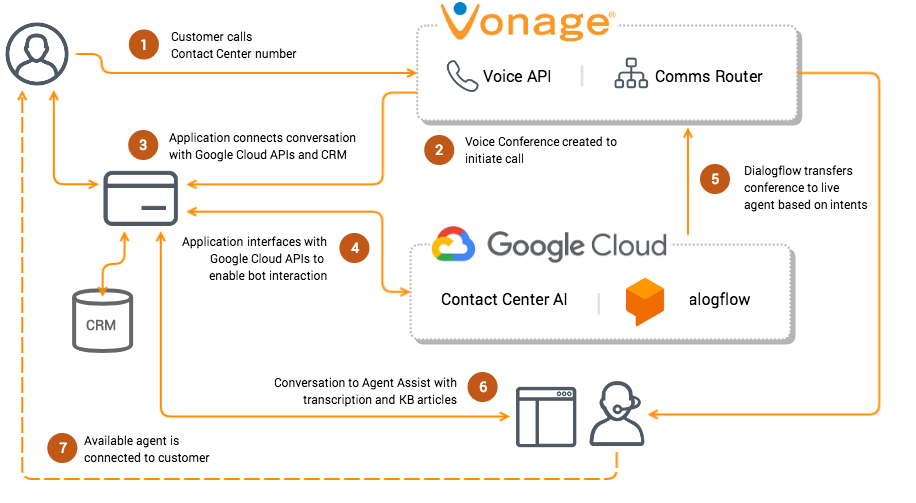
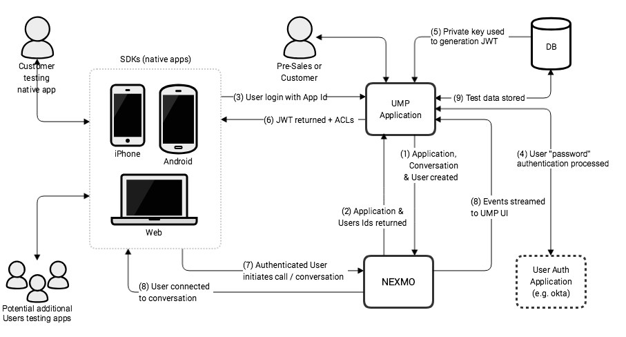
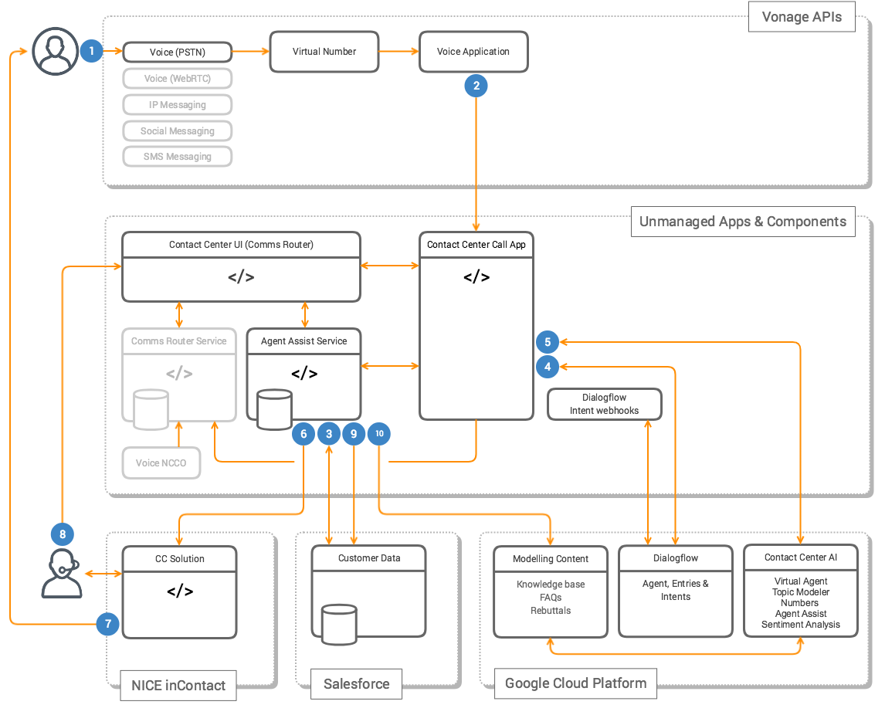

# Google Next 2018 San Francisco (24-26th July)

## Overview
Demo of the American Financing use case integration with Google CC API and Dialogflow. Shows Bot interaction with a customer answering questions, hand off to a Live Agent and an Agent Assist web page with information about the Customer and the Bot conversation.

## Services Used
- Google's Contact Center AI APIs
- Dialogflow ML engine
- Nexmo's Comms Router (skill based routing app)
- Nexmo's Voice APIs

## Documentation
Complete documentation can be found here: [Google Docs](https://docs.google.com/document/d/1joa__7w1CWHCygXKD8Qb2Cgr5D0o7N23Ff6i869hKOA/edit#)

## Demo Video
<figure class="video_container">
  <iframe src="https://www.youtube.com/watch?v=ctfh9JSJBM0" frameborder="0" allowfullscreen="true"> </iframe>
</figure>

## Completed Solution
How to implement integration with Nexmo APIs.

## Future State Architecture
Possible end-to-end architecture of a contact center solution.

